# 🖼️ Coleção Main Wallpapers

Esta é uma coleção de papéis de parede (wallpapers) de **alta qualidade** e com **temas variados**, selecionados cuidadosamente para deixar sua área de trabalho incrível!

O foco está em artes conceituais, paisagens de fantasia, temas espaciais e visuais estéticos.

<!-- ### Alguns Wallpapers

  
  
  
<!-- 

  
  
  

 -->

---

### Artes

<table>
  <tr>
    <td align="center">
      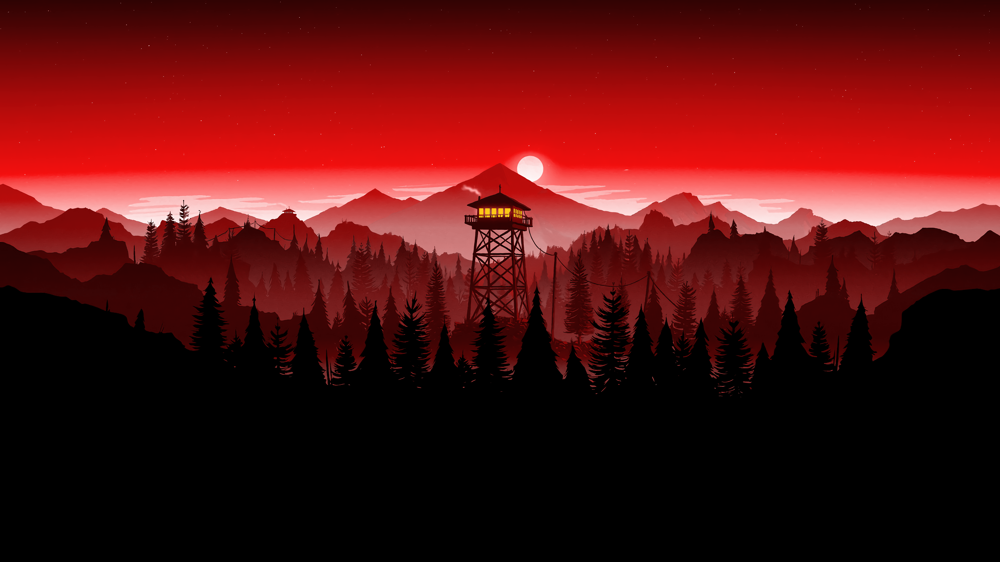 
    </td>
    <td align="center">
      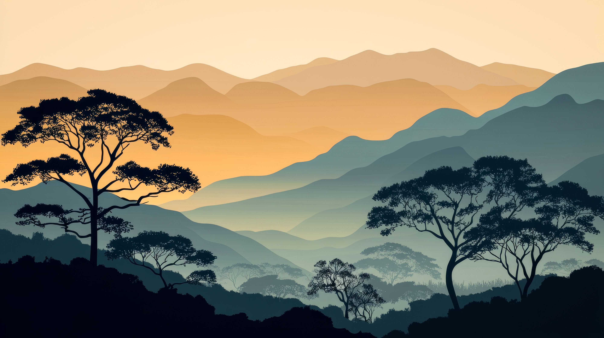 
    </td>
    <td align="center">
       
    </td>
    <td align="center">
      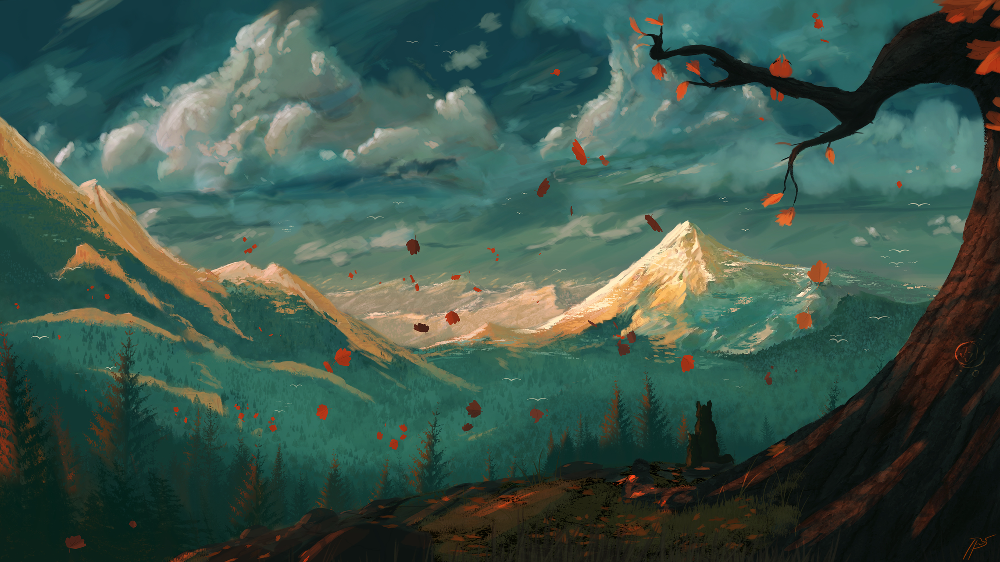 
    </td>
  </tr>
  <tr>
    <td align="center">
      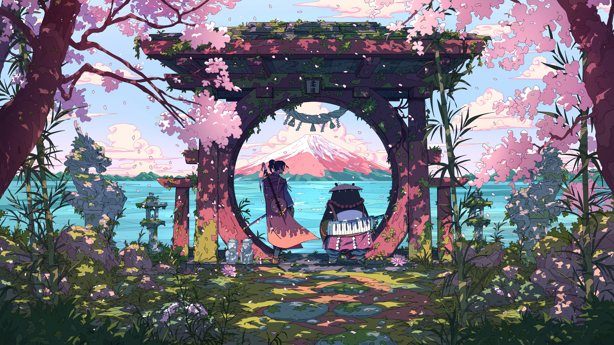 
    </td>
    <td align="center">
      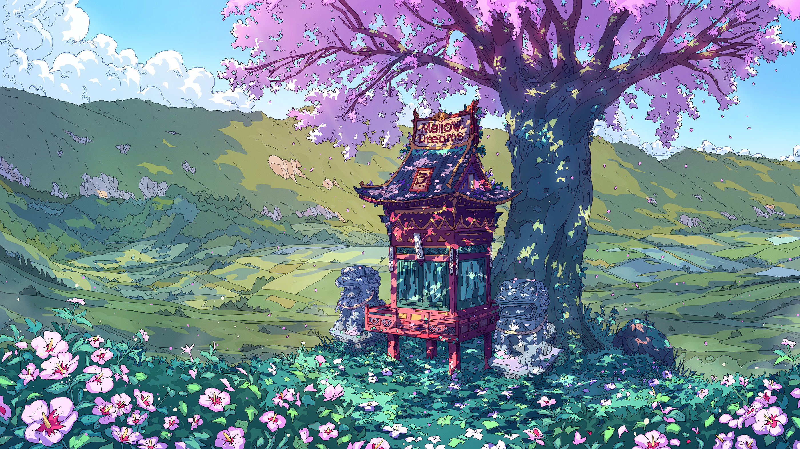 
    </td>
    <td align="center">
      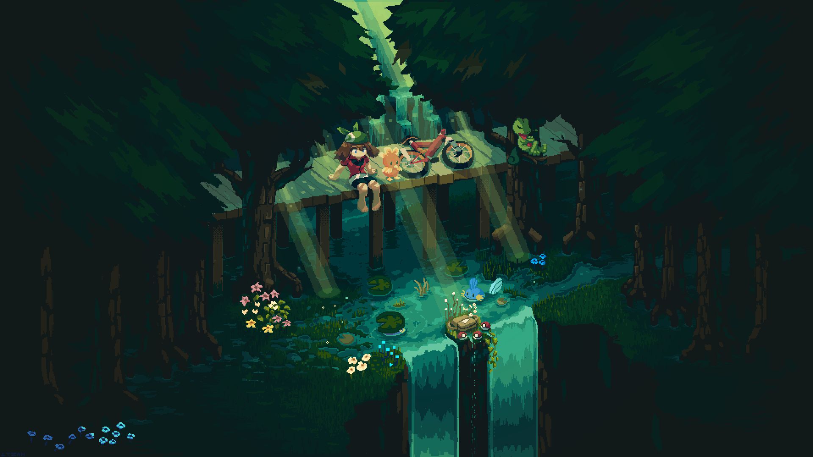 
    </td>
    <td align="center">
       
    </td>
  </tr>
</table>

---

### Space

<table>
  <tr>
    <td align="center">
       
    </td>
    <td align="center">
       
    </td>
    <td align="center">
      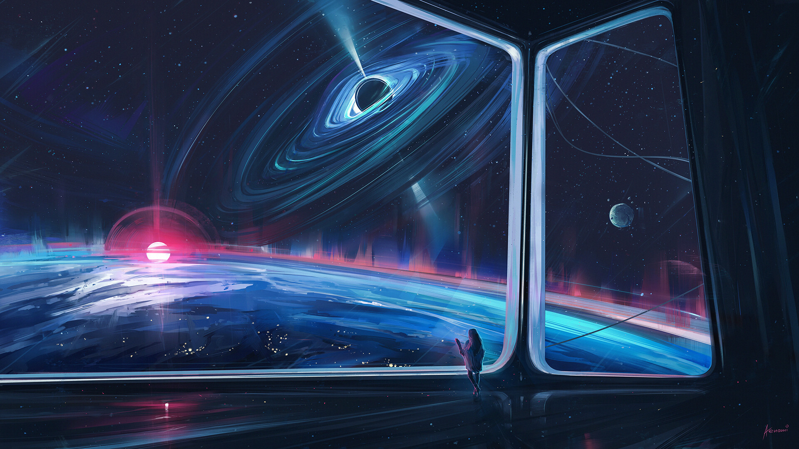 
    </td>
    <td align="center">
      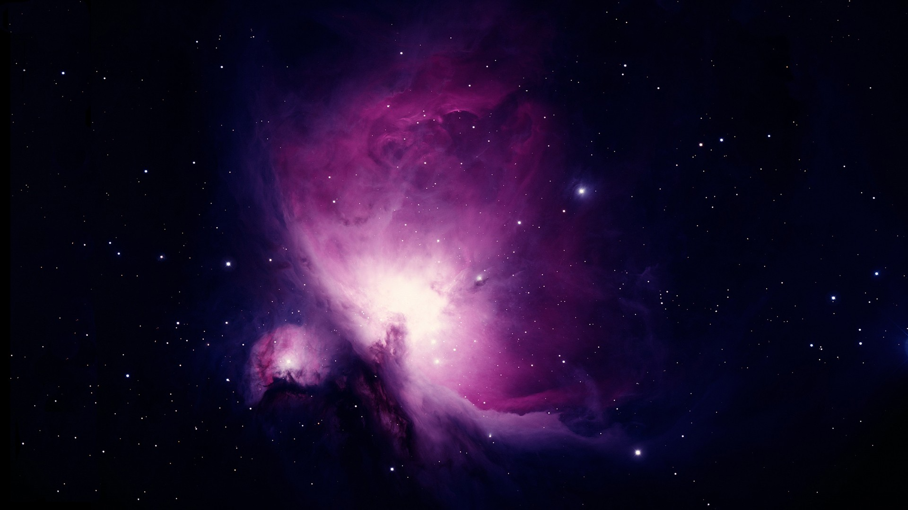 
    </td>
  </tr>
  <tr>
    <td align="center">
       
    </td>
    <td align="center">
      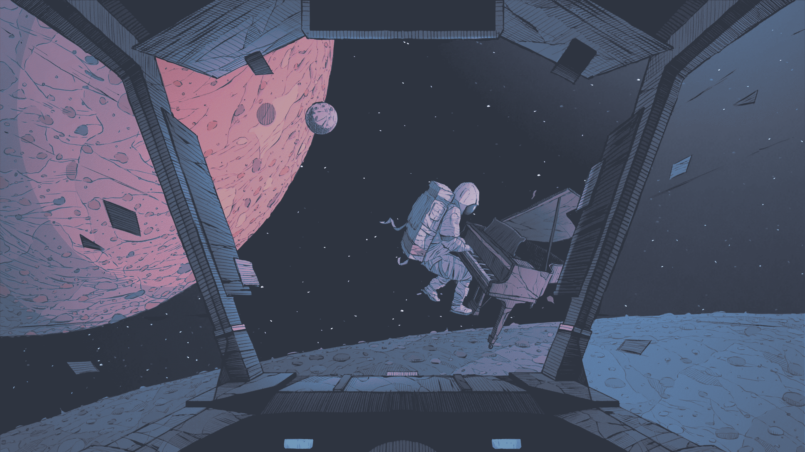 
    </td>
    <td align="center">
      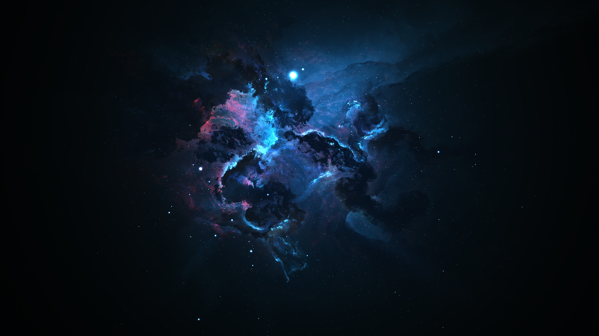 
    </td>
    <td align="center">
      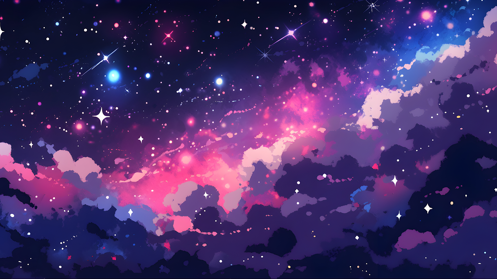 
    </td>
  </tr>
</table>

---

### Mobile

<table>
  <tr>
    <td align="center">
      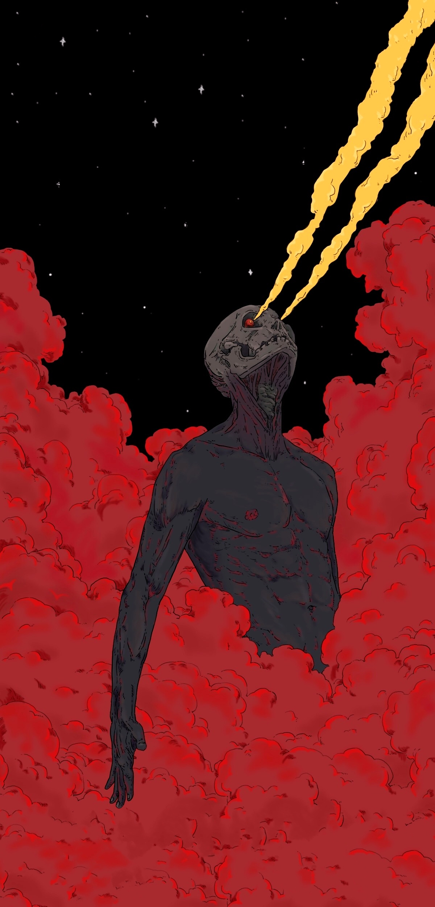 
    </td>
    <td align="center">
      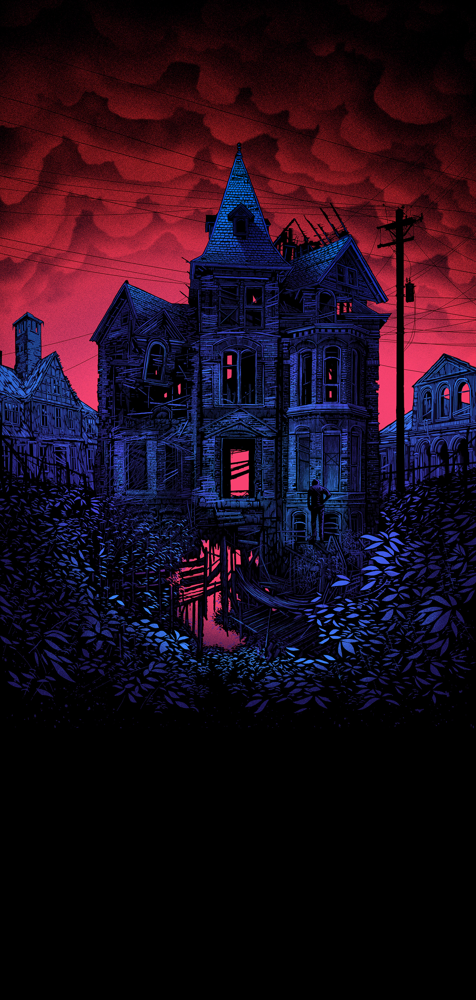 
    </td>
    <td align="center">
       
    </td>
    <td align="center">
      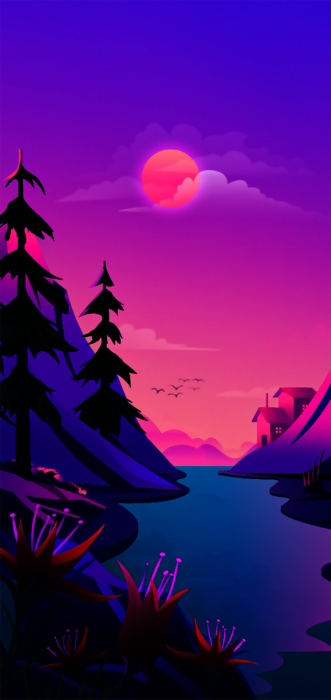 
    </td>
  </tr>
  <tr>
    <td align="center">
      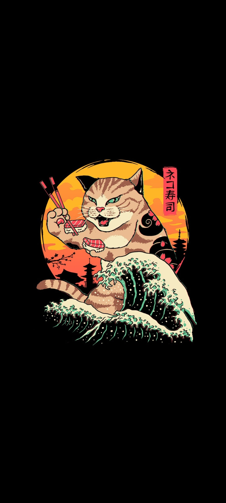 
    </td>
    <td align="center">
      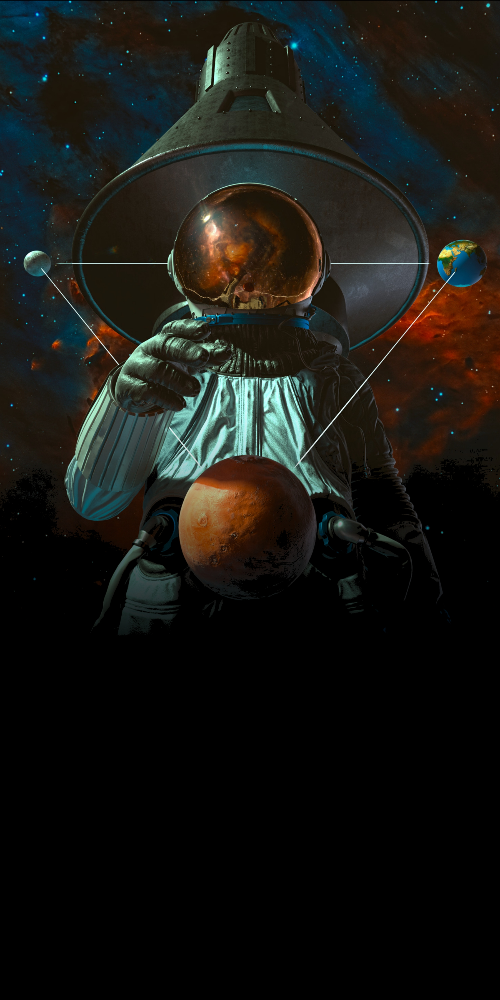 
    </td>
    <td align="center">
      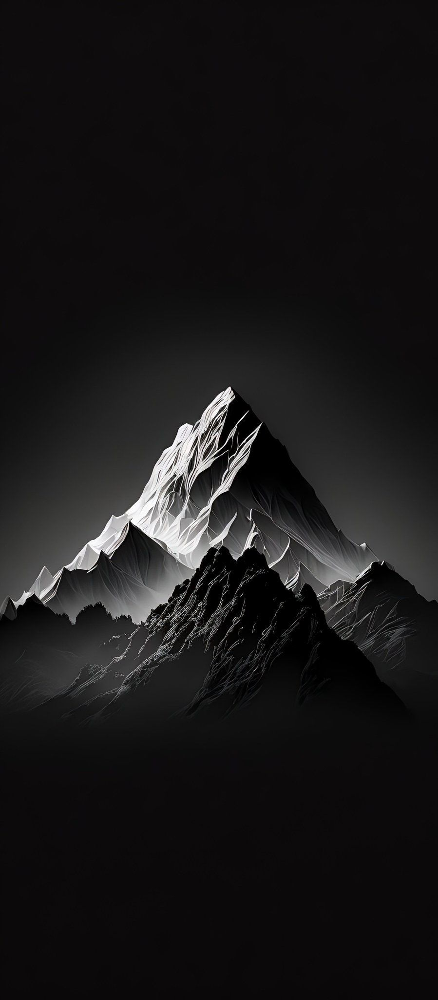 
    </td>
    <td align="center">
       
    </td>
  </tr>
</table>

---

## 📥 Como Baixar os Wallpapers

Você tem duas opções principais para baixar as imagens:

### Opção 1: Download Manual

É o método mais fácil se você quiser apenas alguns arquivos:

1.  Clique no arquivo de imagem desejado (ex: `Fantasy-Autumn.png`).
2.  Na página do arquivo, clique no botão **"View Raw"** (Visualizar Original) no canto superior direito.
3.  A imagem será aberta em tela cheia. Clique com o botão direito do mouse sobre ela e selecione **"Salvar imagem como..."** para fazer o download.

### Opção 2: Baixar Todos os Arquivos (Recomendado)

Se você deseja obter a coleção completa de uma só vez, utilize o git para fazer o download de todos os wallpapers de uma vez:

1. Pressione botão Super (Windows) + R.
2. Digite 'cmd' e tecle Enter.
3. Navegue até o local aonde quer deixar as imagens baixadas.
4. Então use: git clone https://github.com/ElijahMF/wallpapers ~/Wallpapers

---

## 🔗 Licença

Todas as imagens neste repositório são fornecidas apenas para **uso pessoal** como papel de parede.
